# _Menu Manager_
    Menu Manager is a site where a chain of hotels/restrants can have a central point for menu, dish and recipe management. Keeping the same stand across all locations.

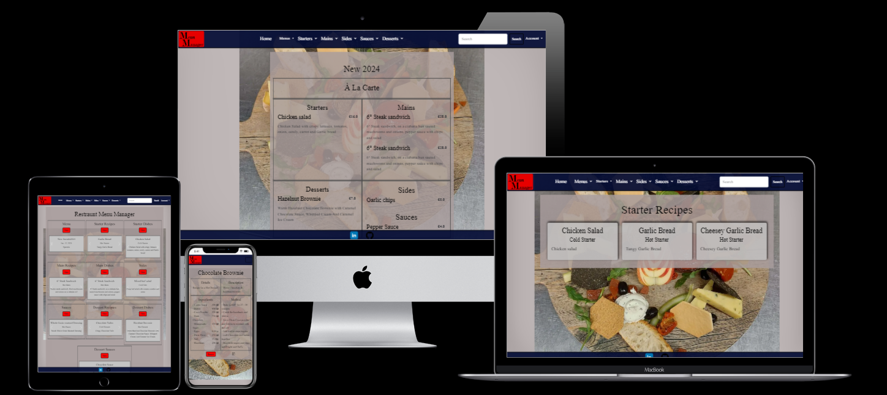

[_Click here to view live deployment_](https://menu-manager-32aec1a9f4d5.herokuapp.com)

# _Content Menu_

- [Menu Manager](#menu_manager)
- [Content Menu](#content-menu)
- [Strategy Plane](#strategy-plane)
- [Scope Plane](#scope-plane)
- [Structure Plane](#structure-plane)
  - [_Features_](#features)
    - [_Implemented Features_](#implemented-features)
      - [Site Features](#site-features)
        - [Home Page](#home-page)
        - [Header](#header)
        - [Footer](#footer)
      - [Accounts](#accounts)
      - [Products](#products)
      - [Recipes](#recipes)
        - [Starters](#starters)
        - [Mains](#mains)
        - [Sides](#sides)
        - [Sauces](#sauces)
        - [Desserts](#desserts)
        - [Dessert Sauces](#dessert-sauces)
        - [Recipe Add Edit](#recipe-add-edit)
        - [Recipe Delete](#recipe-delete)
      - [Dishes](#dishes)
        - [Starter Dishes](#starter-dishes)
        - [Main Dishes](#main-dishes)
        - [Dessert Dishes](#dessert-dishes)
        - [Dishes Add Edit](#dishes-add-edit)
        - [Dishes Delete](#dishes-delete)
      - [Menus](#menus)
        - [Menus Page](#menus-page)
          - [Add/Edit Menu](#addedit-menu)
          - [Early Bird Menu View](#early-bird-menu-view)
          - [Specials Menu View](#specials-menu-view)
          - [À la carte Menu View](#à-la-carte-menu-view)
          - [Menu Delete](#menu-delete)
      - [Favicon](#favicon)
      -[Errors](#errors)
        - [403 Error](#403-error)
        - [404 Error](#403-error)
        - [500 Error](#500-error)
    - [_Features to be Implemented_](#features-to-be-implemented)
- [Skeleton Plane](#skeleton-plane)
  - [Database](#design)
  - [WireFrames](#wireframes)
- [Surface Plane](#surface-plane)
  - [Design](#design)
  - [Colour And Style Scheme](#colour-and-style-scheme)
  - [Typography](#typography)
  - [Imagery](#imagery)
- [Bugs, Testing & Validation](#bugs,-testing-&-validation)
  - [Bugs](#bugs)
  - [Testing](#testing)
  - [Validation](#validation)
- [Technologies](#technologies)
- [Deployment](#deployment)
  - [1 - Version Control](#1---version-control)
  - [2 - Page Deployment](#2---page-deployment)
  - [3 - Cloning Repository](#3---cloning-repository)
- [Credits](#credits)

# _Strategy Plane_

# _Scope Plane_
    Fully responsive Design that will function on all device off 320px and up.
    Hamburger with offcanvus menu for mobile devices.
    Full CRUD functionality on Products Recipes, Dishes and Menus.
    Restricted role for different user types features.

# _StructurePlane_
## _Features_
### _Implemented Features_

#### **Site Features**

##### **Home Page**
    The home page has each section of the site using carousels desplaying that sections recipes, dishes or menus. for a genarle user they will only be able to navigate to view each item as where an admin user will have to option to navigate to add items to the selected section.

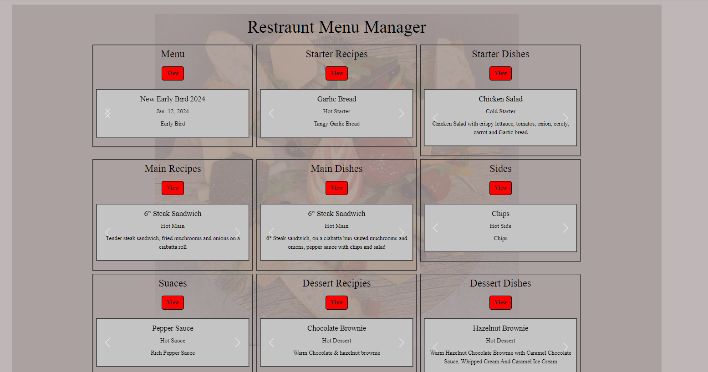

##### **Header**
    The navbar is a deep blue with white text. with the red and black logo with a search feature allowing the user to search the site. 
    the search bar is locked to the section the user is on when they are navigated away from the home page.
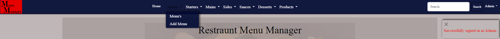

    The mains and starters dropdown has recipies, add recipes, dishes and add dishes as options.
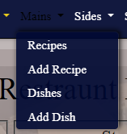

    The sides and sauces dropdown has recipies and add recipes as options.

    The menus dropdown has menus and  add menu as options.
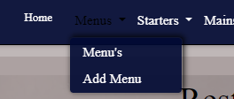

    The dessert dropdown has recipies, add recipes, dishes, add dishes, sauces and add sauces as options.
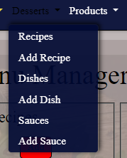

##### **Footer**
    The footer is the same dark blue as the header and just consists of a link to the git hub repository
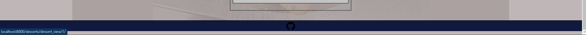

#### **Accounts**
    Sign Up form allowing new users to sign up to the site. once signed up users will be dirrected to home page and will have to navigate to sign in.
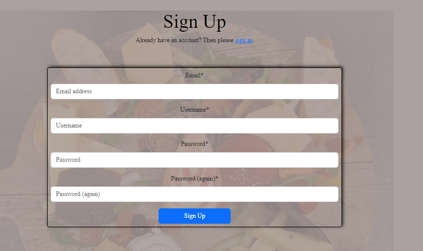

    Sign in form allowing users to sign in to the site. once signed in users will be dirrected to home page.
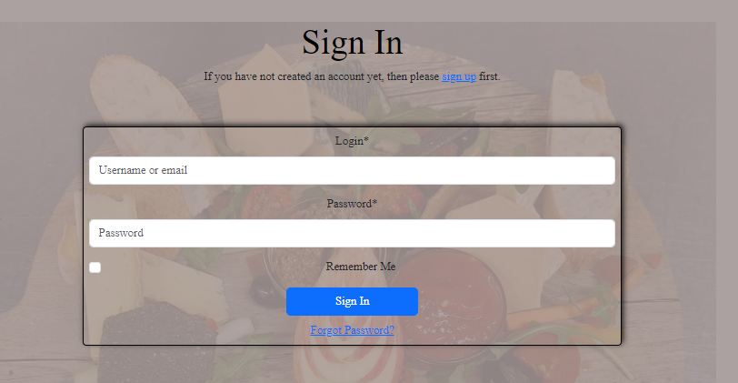

    On the navbar when a user is logged in the account menu will say the users name.

    When the user goes to log out they will be prompt with a confirmation screen, and if confirmed they will be looged out and redirected to the home page.

#### **Products**
    PRoducts are only available to admin users. when an admin user navigates to the product view they will see the list of products with the search bar at the top of the page with an add buttton to the right.
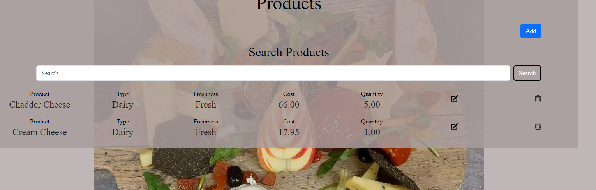

    When the add button on the add product link in the nav bar is clicked the admin user will be directed to add a new product form and once completed will be directed back to the product view page.
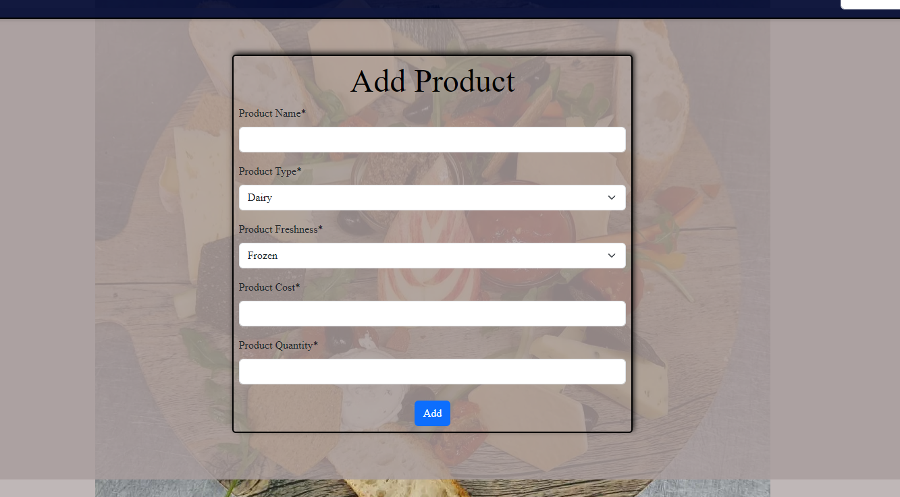

    When the edit button on the Individual product is clicked the admin user will be directed to edit the  product and once completed will be directed back to the product view page.
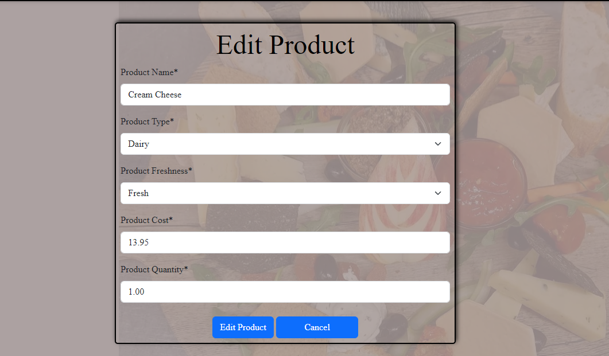

    When the delete button on the Individual product is clicked the admin user will be directed to confirm deletion of the product and once completed will be directed back to the product view page.
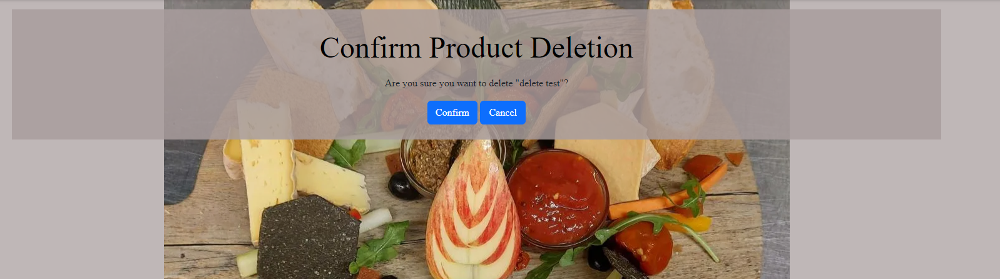

#### **Recipes**

##### **Starters**
    Starter Recipe main page Shows all recipes that have been created. Users can click on the tiles to navigate to that praticular recipe.
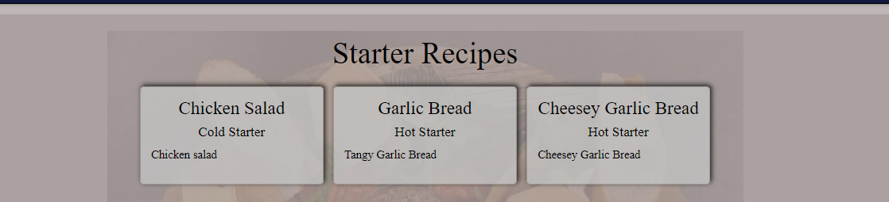
##### **Mains**
    Main Course Recipe main page Shows all recipes that have been created. Users can click on the tiles to navigate to that praticular recipe.
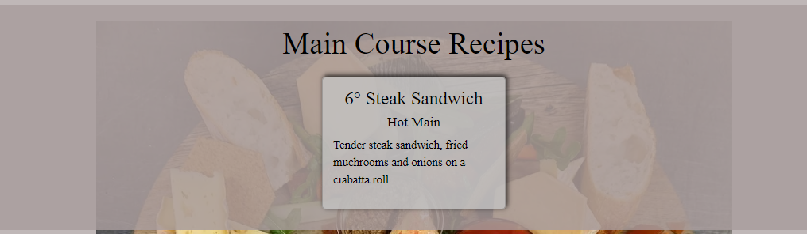
##### **Sides**
    Side Recipe main page Shows all recipes that have been created. Users can click on the tiles to navigate to that praticular recipe.
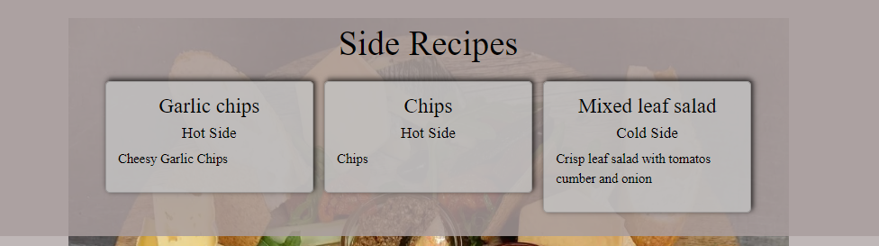
##### **Sauces**
    Sauce Recipe main page Shows all recipes that have been created. Users can click on the tiles to navigate to that praticular recipe.
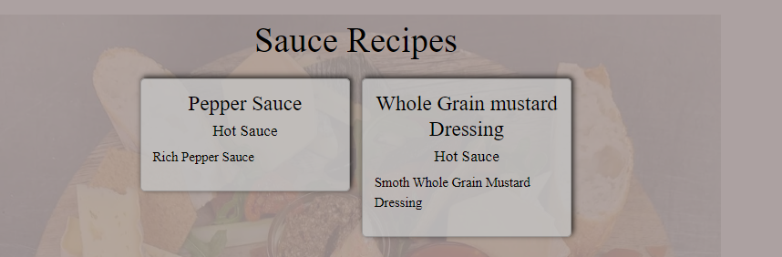
##### **Desserts**
    Dessert Recipe main page Shows all recipes that have been created. Users can click on the tiles to navigate to that praticular recipe.
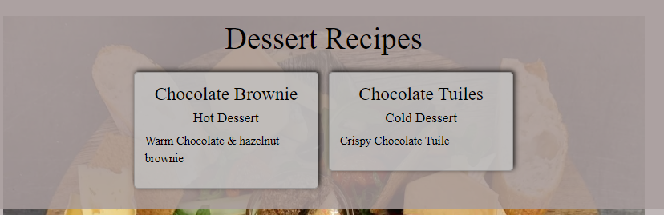
##### **Dessert Sauces**
    Dessert Sauce Recipe main page Shows all recipes that have been created. Users can click on the tiles to navigate to that praticular recipe.

##### **Recipe Add Edit**
    Only Admin users can Add recipes. for Starters, Mains, Sides, Sauces, Desserts or Dessert sauces recipes the proccess is the same and the forms and lay out are identical. then the admin user clicks one of the add recipe links in the nav bar they will be directed to the add recipe form. Once the form is filled out the admin user will be directed to the recipe view page where the will be able to add the ingredients that is show in a drop down ment populated from the products database. they will also be able to add the method from this view aswell.
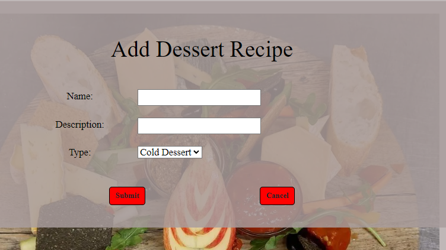

    Once the Admin users has created the recipe. They will be directed to the recipe view where they can add the ingredients and method for the recipe.
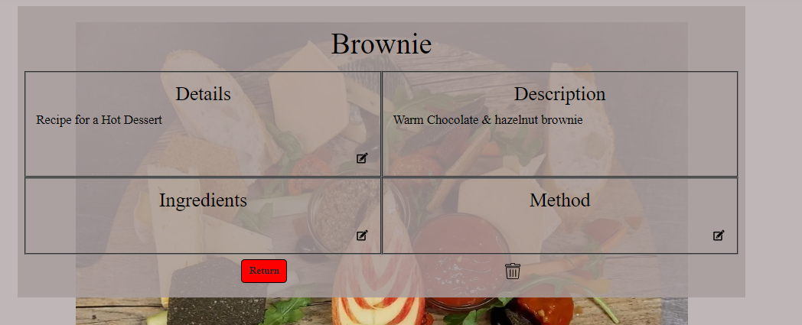

    Only Admin users can edit recipes. This is the same view that appears after adding the recipe. When the admin user is on the recipe view they will be able to edit each section of the recipe separately by clicking on the edit icons.
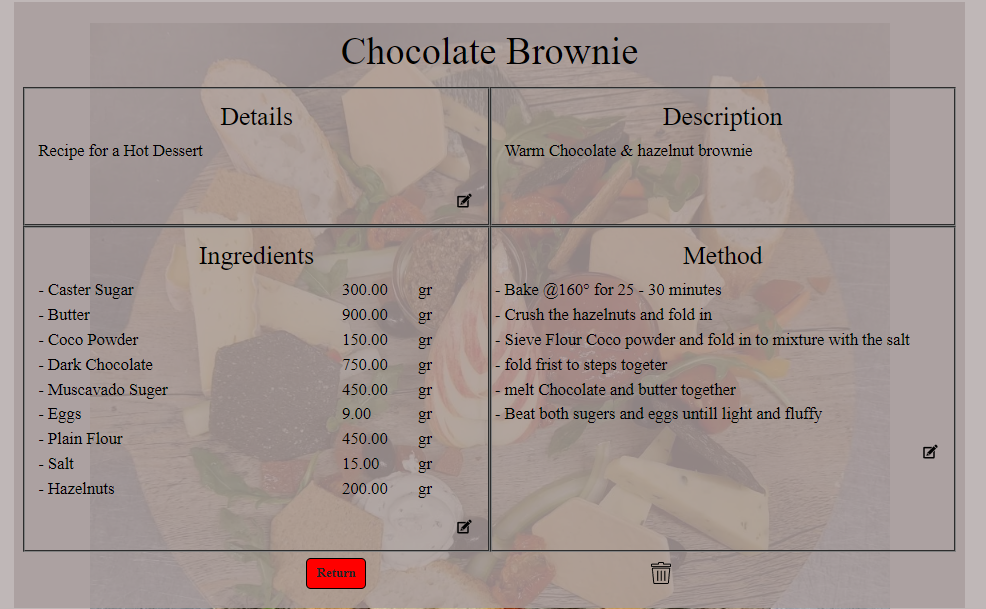

##### **Recipe Delete**
    Recipes can only be deleted by admin users When the delete button is clicked the admin user will be directed to confirm deletion of the recipe and once completed they will be directed back to the recipe view page for Starters, Mains, Sides, Sauces, Desserts or Dessert sauces depending what the recipe was deleted.
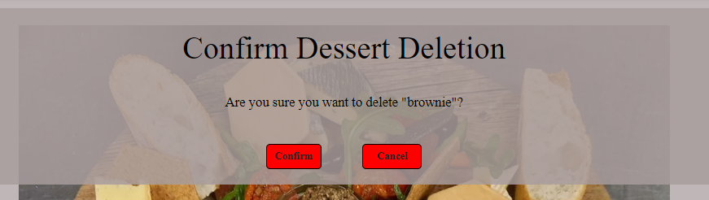

#### **Dishes**

##### **Starter Dishes**
    Starter Dishes main page Shows all Starter Dishes that have been created. Users can click on the tiles to navigate to that praticular Starter Dish.
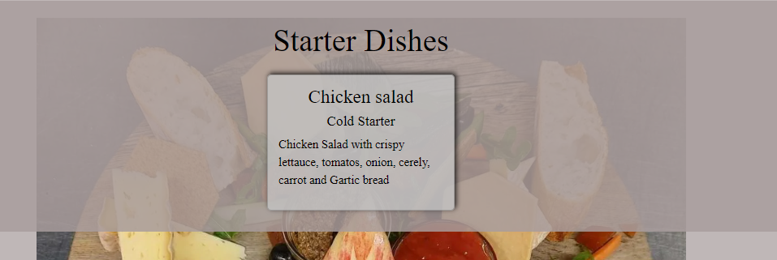
##### **Main Dishes**
    Main Course Dishes main page Shows all Main Course Dishes that have been created. Users can click on the tiles to navigate to that praticular Main Course Dish.
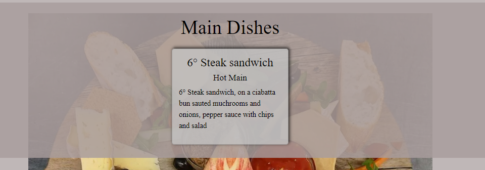
##### **Dessert Dishes**
    Dessert Dish main page Shows all Dessert Dishes that have been created. Users can click on the tiles to navigate to that praticular Dessert Dish.
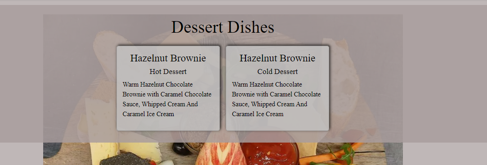
##### **Dishes Add Edit**
    Only Admin users can Add dishes. for Starter Dishes, Main Dishes or Dessert Dishes the proccess is the same and the forms and lay out are identical for Starter Dishes and Dessert Dishes. when the admin user clicks one of the add dishes links in the nav bar they will be directed to the add dishes form. Once the form is filled out the admin user will be directed to the dish view page. 
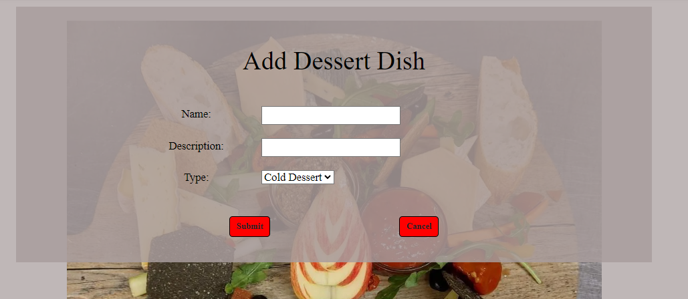
    Once directed to the dish view where they will be able to add the sauces and elements fom populated drop down menus for the praticular items eg. elements from the recipes and sauces from the sauces. and Main dishes has and extra item for sides that populates using drop down menus populated from the side recipies.
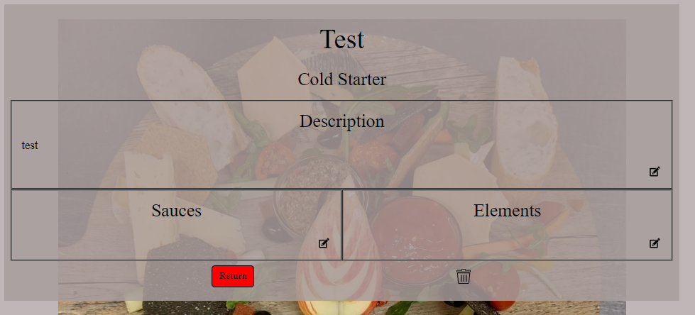
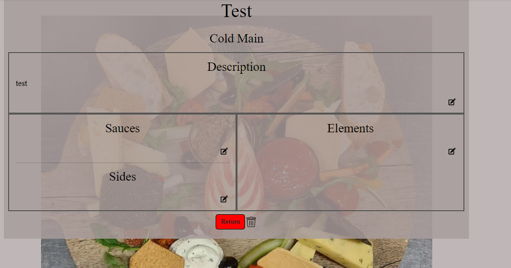
    Only Admin users can edit dishes. This is the same view that appears after adding the dishes. When the admin user is on the recipe view they will be able to edit each section of the recipe separately by clicking on the edit icons.
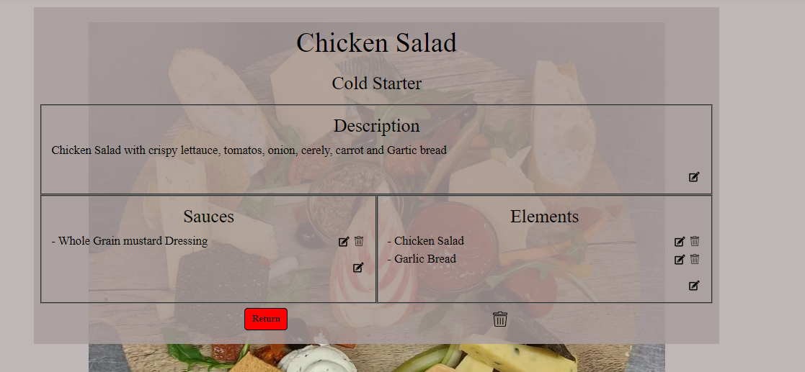
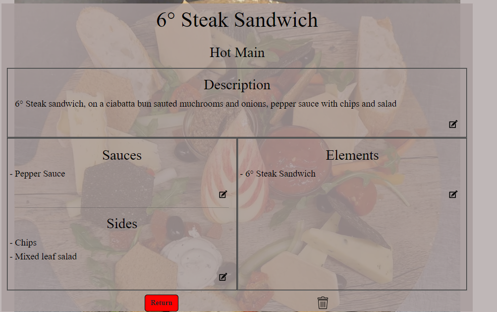
##### **Dishes Delete**
    Dishes can only be deleted by admin users When the delete button is clicked the admin user will be directed to confirm deletion of the Dish and once completed they will be directed back to the dish view page for Starter Dishes, Main Dishes or Dessert Dishes depending what the Dish was deleted.
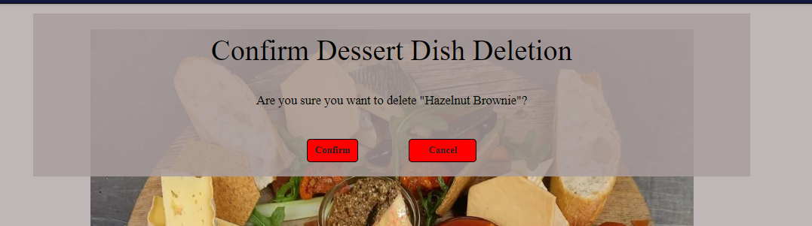

#### **Menus**
##### **Menus Page**
    When a user navigates to the menu sectio they will see this page first. it has the 3 different menus in the own sections,
    A user can select a menu by clicking on it and it will take them to that menu style view and from there they will be able to edit od delete the menu.
##### **Add/Edit Menu**
    When the user clicks on the add menu via the nav bar they will be prompt with the add menu form.
    Depending on the menu type the choose will run though different stages to generate the desired menu.

    The add starters will be the next form this will allow the user to add multiple mains items before moving on.

    The add mains will be the next form to allow the user to add multiple mains items before moving on.

    The adding of sides will only show for the À la carte Menu Choice.
    If the À la carte Menu Choice is selected the user can add multiple items before moving on.

    The adding of sauces this will also only show for the À la carte Menu Choice.
    If the À la carte Menu Choice is selected the user can add multiple items before moving on.

    And finally the adding of desserts which also allows the user to add multiple items before moving on to view the menu.

    The edit menu can be accessed from the single menu view which is only avalible to admin/superusers.
    the edit menu will loop back though the same proccess as adding a new menu aloowing the user to remove add or edit menu items.

##### ** Early Bird Menu View**
    This is the Early Bird Menu View. which anybody can view but if the user is not superuser/admin then the edit and bit buttons will not be displayed.

##### **Specials Menu View**
    This is the Specials Menu View. which anybody can view but if the user is not superuser/admin then the edit and bit buttons will not be displayed.

##### **À la carte Menu View**
    This is the À la carte Menu View. which anybody can view but if the user is not superuser/admin user then the edit and bit buttons will not be displayed.

##### **Menu Delete**
    When superuser/admin user Clicks on the delet button they will be prompt with a deletion confermation screen. if click  Confirm the menu will be deleted and will return to the main menu page.
    If Cancel is clicked they will be returned to the menu they was viewing.  

#### **Favicon**
    * A favicon was implemented to Show the user that They still are pressent on site
    * This also provides an image in the tabs to allow the user to easily identify the website if they have multiple tabs open.
#### **Errors**
##### **403 Error**
    * A 403 error page has been implemented to provide feedback to the user when they try to access unauthorized content or actions.
    * This covers the actions of adding, updating and deleting of content for all users except those how are admin users.
##### **404 Error**
    * A 404 error page has been implemented to provide feedback to the user if they try to open a page that does not exist.
##### **500 Error**
    * A 500 error page has been implemented to provide feedback to the user that the server has encounted a problem.  
### _Features to be Implemented_
    * Add Allergen Choices to the menu dishes
    * Add Costings to the recipes that then can generate 70% gdp for dishes and the menus.
    * Hide features on buttons as others sho during the adding og ingredients and steps on the recipe pages, also the elements, sauce and sides ont the dish pages.
# _Skeleton Plane_
## _Database_
## _WireFrames_
# _Surface Plane_
## _Design_
### _Colour And Style Scheme_
    Colour used within the site. 
    --background: #a89d9dbb;
    --header-footer: #000933e7;
    --nav-txt: #fffefe;
    --nav-hover-txt: #e9ca1c;
    --btn-hover-txt: #000000b9;
    --btn-color: #ff0000;
    --header-txt: #000000;
    --main-txt: #000000;
    --bg-cover: #a89d9dd7;
    --carousel-card: #c4c4c4;
    --card-bg: #c4c4c4c0;
    --card-hover: #e9ca1c;
    --delete: #af0808;
    --clear: #ffffff00;

    Box Styling used within the site
    --box-shadows: 2px -3px 8px 0 #000000c9;
    --borders: 2px solid #000000;
    --border-view: 3px groove #818181;

### _Typography_
    For the headers EB Garamond has been used with serif, arial as backups if not suppoetrd by a curtin browser.
    For the main text Roboto has been used with serif, arial as backups if not suppoetrd by a curtin
    EB Garamond and Roboto are both imported from google fonts and was imported into the style sheet.
### _Imagery_
    The Logo was created by using paint 3d and using text on a transparent canvas.
    The Background image is a personal photo taken whilst working in a kictch.
# Bugs, Testing & Validation

## _Bugs_
    After Testing the site there does not appeart to be any faults with the functions of the site main features.
    whit that in mind the only minor bug that can be seen at pressent is the messages outputed to the user after updating items with out redirecting are only shown when the page is reloaded.

## Testing
    For testing with results click the link below to navigate to the testing md file (This is separate to reduce the readme file size)
  [TESTING.md](TESTING.md)
## _Validation_
    All file passed through the [Code Institute PEP8](https://pep8ci.herokuapp.com/) Validator after removing a few white spaces and Shortening a few line lenghts.

    The site passed through W3 Valadator with just a few minor errors on carousel ids as they had same name, so after remaning them it passed.

# _Technologies_
#### **Python/ Django**
    Python is the main proggraming language whilst using the django framework.
#### **HTML**
    Used to for main website language.
#### **CSS**
    For the styling for the website.
#### **Bootstarp 5.3.2**
    Is used With in the site for different styling and for responsiveness.
#### **[UXWing](uxwing.com)**
    Used for difrerent icons through out the site.
#### **Git**
    Used to commit and push through out the development.
#### **[balsamiq](https://balsamiq.com/)**
    wireframes were created using balsamiq.
#### **[TinyPNG](https://tinypng.com/)**
    Was used to compress the background image 
#### **[cloudconvert](https://cloudconvert.com/webp-converter,)**
    Was used to change image files to webp.
#### **[ElephantSQL](https://www.elephantsql.com/)**
    To store the site data.  ElephantSQL is a ProsgreSQL based database.
#### **[Cloudinary](https://cloudinary.com/)**
    Was used For the storage of static file and images.
#### **[favicon](https://favicon.io/favicon-generator/)**
    Favicon.io was used to generate the favicon.
#### **[LucidChart](https://www.lucidchart.com/pages/)**
    Was used to create the flow chart showing the website functionality and flow.
#### **[GitHub](https://www.github.com)**
    Is the main repository site files.
#### **[Gitpod](https://www.gitpod.io)**
    Was the main the coding environment.
#### **[Heroku](https://www.heroku.com)**
    Is used to deploy the website to the web.
#### **[Techsini.com](https://techsini.com/multi-mockup/index.php)**
    Is used to create the mockup image for the readme.
# _Deployment_
## _1 - Version Control_
    Verion controle was maintained using GIT within GitPod to push code to the GitHub repository

    From the Gitpod terminal use "git add ." which tells git you would like to make changes/updates to the files.

    Then use "git commit -m " with a comment, this will commit the changes and update the files.

    Then using the "git push" command this will push the committed changes to your GitHub repository.
## _2 - Page Deployment_
    Go to Heroku and log in

    click "New" to create a new app from the dashboard

    Choose app name and select your region, press "Create app".

    Go to "Settings" and navigate to Config Vars.

    Add Config Vars. 
      This app used 4 confid vars 
        * for the clouninary (KEY: CLOUNDINARY_URL / VALUE: *****)
        * for the database (KEY: DATABASE_URL / VALUE: ****** )
        * KEY: SECRET_KEY / VALUE:*******
        * KEY: PORT / VALUE = 8000.
 
    Now go to the Deploy tab.
    
    Scroll Down to Deployment Method and select GitHub.
    
    Select repository to be deployed and connect to Heroku.
    
    Now Scroll down to depoly : 
      * Option 1 is selecting Automatic deploys (Will Update Automaticly when every git push to the repository).
      * Option 2 is selecting Manual deploy (Needs to be redeployed after every change manually via Heroku deploy tab).
 Visit the live deployment [HERE](https://menu-manager-32aec1a9f4d5.herokuapp.com).
## _3 - Cloning Repository_
 * To clone the repository for download or use within your GitHub head-over to this [link](https://github.com/git-guides/git-clone) 
# _Credits_
* I used [python.org](https://www.python.org/) for References for the Pyhton code and functionality

* I used [w3schools](https://www.w3schools.com/python/default.asp) for References for the Pyhton code and functionality

* I used [stackoverflow](https://stackoverflow.com/) for References for the Pyhton code and functionality

* I Used [Django Docs](https://docs.djangoproject.com/en/5.0/) to the reference for the django code and functionality