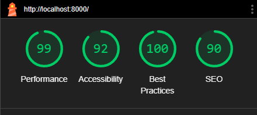

# _Test Menu_

- [Test Menu](#test-menu)
- [Functional Testing](#functional-testing)
    - [Authentication](#authentication)
    - [Products](#products)
    - [Starters](#starters)
    - [Main Courses](#main-courses)
    - [Desserts](#desserts)
    - [Sides](#sides)
    - [Sauces](#sauces)
    - [Dessert Sauces](#dessert-sauces)
    - [Starter Dishes](#starter-dishes)
    - [Main Course Dishes](#main-course-dishes)
    - [Dessert Dishes](#dessert-dishes)
    - [Menus](#menus)
    - [Navigation](#navigation)
    - [Footer](#footer)
- [Bugs](#structure-plane)
- [Validation](#features)
    - [PEP8 Valadator](#implemented-features)
    - [W3 Valadator](#site-features)
    - [Lighthouse Report](#home-page)
- [Responsiveness](#header)
## _Functional Testing_

### _Authentication_
#### Registration
**Description**:

    a user can sign up to the website

**Steps**:
1. Navigate to [_Menu Manager_](https://menu-manager-32aec1a9f4d5.herokuapp.com) go to  the account menu and click Register.
2. Enter email, username and password 

3. Click Sign Up Button

**Expected**:

    After clicking on the "Sign Up" button registration is successful, User is redirected to the home page

**Actual**: 

    clicking on the "Sign Up" button registration is successful, User is redirected to the home page

#### Sign In
**Description**:

    a user can sign in to the website

**Steps**:
1. Navigate to [_Menu Manager_](https://menu-manager-32aec1a9f4d5.herokuapp.com) go to  the account menu and click Login.

2. Enter email or username and password 

3. Click Sign In button

**Expected**:

    After clicking on the "Sign In" button user is signed in and redirected to the home page

**Actual**: 

    clicking on the "Sign In" button user is signed in and redirected to the home page

#### Sign In
**Description**:

    a user can sign out of the website

**Steps**:
1. Navigate to [_Menu Manager_](https://menu-manager-32aec1a9f4d5.herokuapp.com) go to the account menu and click Sign Out.

2. Click confirm on the confirm logout page

**Expected**:

    After clicking on the "Sign Out" Link user is redirected to confirm logout page, Click the Confirm button and the user is logged out and redirected to the home page

**Actual**: 

    Clicking on the "Sign Out" Link user is redirected to confirm logout page, Clicking the Confirm button and the user is logged out and redirected to the home page

### _Products_

#### Add Product
**Description**:

    an admin user can add a product

**Steps**:
1. Navigate to [_Menu Manager_](https://menu-manager-32aec1a9f4d5.herokuapp.com) go to the account menu and click Signin.

2. Once signed in navigate to the product page. click add button.

3. Complete add product form and click Add Button.

**Expected**:

    After Fillout form and clicking add the product is added and shows in the product list.

**Actual**: 

    completed form adds and product shows on product list on product page.

#### Edit Product
**Description**:

    an admin user can edit a product

**Steps**:
1. Navigate to [_Menu Manager_](https://menu-manager-32aec1a9f4d5.herokuapp.com) go to the account menu and click Signin.

2. Once signed in navigate to the product page. click edit icon for selected product.

3. Product opens up in a form to be edited.

4. Complete edit product form and click Edit Product Button.

**Expected**:

    After Fillout form and clicking edit product, the edited product shows in the product list with new updated information.

**Actual**: 

    completed form edits the product shows on product list with new product information.

#### Delete Product
**Description**:

    an admin user can Delete a product

**Steps**:
1. Navigate to [_Menu Manager_](https://menu-manager-32aec1a9f4d5.herokuapp.com) go to the account menu and click Signin.

2. Once signed in navigate to the product page. click Delete icon for selected product.

3. Confirmation of delete page opens.

4. Click confirm.

**Expected**:

    Product deleted and removed freom the product list.

**Actual**: 

    producted deleted and was removed from product list

### _Starters_
#### Add Starter
**Description**:

    an admin user can Add a Starter

**Steps**:
1. Navigate to [_Menu Manager_](https://menu-manager-32aec1a9f4d5.herokuapp.com) go to the account menu and click Signin.

2. Once signed in navigate to the add starter on the navbar. 

3. Fill Out add starter form.

4. click submit.

**Expected**:

    After Fillout form and clicking submit, admin user is redirected to starter view to add ingregients and method.

**Actual**: 
    After Fillout form and clicking submit, admin user is redirected to starter view to add ingregients and method.

#### Add Starter Ingredient
**Description**:

    an admin user can Add a Starter Ingredient

**Steps**:
1. click add button on starter view

2. add ingredient form shows  

3. complete and click add

**Expected**:

    After Fillout form and clicking add, ingregients appears above and allows for more items to be added.

**Actual**: 
    After Fillout form and clicking add, ingregients appears above and allows for more items to be added.

#### Add Starter Method
**Description**:

    an admin user can Add a Starter Method.

**Steps**:
1. click add button on starter view.

2. add Method form shows.  

3. complete and click add.

**Expected**:

    After Fillout form and clicking add, method appears above and allows for more items to be added.

**Actual**: 
    After Fillout form and clicking add, methods appears above and allows for more items to be added.

#### edit Starter
**Description**:

    an admin user can edit a Starter.

**Steps**:
1. click edit button on starter view.

2. click edit icon on starter details secton of the view.

3. complete and click submit.

**Expected**:

    After Fillout form and clicking submit, edits appears in the details section with edited information.

**Actual**: 
    After Fillout form and clicking submit, edits appears in the details section with edited information.

#### edit Starter Ingredient
**Description**:

    an admin user can edit a Starter Ingredient.

**Steps**:
1. click edit button on starter view.

2. click edit icon on ingredients secton of the view.

2. edit icon next to the selected ingredient and form shows.

3. complete and click submit.

**Expected**:

    After Fillout form and clicking submit, ingregients appears above with new edited information.

**Actual**: 
    After Fillout form and clicking submit, ingregients appears above with new edited information.

#### Edit Starter method
**Description**:

    an admin user can edit a Starter method.

**Steps**:
1. click edit button on starter view.

2. click edit icon on method secton of the view.

3. edit icon next to the selected method and form shows.

4. complete and click submit.

**Expected**:

    After Fillout form and clicking submit, method appears above with new edited information.

**Actual**: 
    After Fillout form and clicking submit, method appears above with new edited information.

#### delete Starter Ingredient
**Description**:

    an admin user can delete a Starter Ingredient.

**Steps**:
1. click edit button on starter view.

2. click edit icon on ingredients secton of the view.

3. click the delete icon next to the selected ingredient

**Expected**:

    clicking the delete icon next to the ingredient, ingredient is deleted

**Actual**: 
    clicking the delete icon next to the ingredient, ingredient is deleted

#### delete Starter Method Step
**Description**:

    an admin user can delete a Starter Method step.

**Steps**:
1. click edit button on starter view.

2. click edit icon on ingredients secton of the view.

3. click the delete icon next to the selected method step.

**Expected**:

    clicking the delete icon next to the method step, method step is deleted.

**Actual**: 
    clicking the delete icon next to the method step, method step is deleted.

#### Delete Starter
**Description**:

    an admin user can Delete a Starter.

**Steps**:
1. Navigate to [_Menu Manager_](https://menu-manager-32aec1a9f4d5.herokuapp.com) go to the account menu and click Signin.

2. Once signed in navigate to the starter page.

3. Click on selected starter.

4. Click on the delete icon.

3. Confirmation of delete page opens.

4. Click confirm.

**Expected**:

    Starter deleted and removed from the Starter list.

**Actual**: 

    Starter deleted and removed from the Starter list.

### _Main Courses_
#### Add Main Course
**Description**:

    an admin user can Add a Main Course

**Steps**:
1. Navigate to [_Menu Manager_](https://menu-manager-32aec1a9f4d5.herokuapp.com) go to the account menu and click Signin.

2. Once signed in navigate to the add Main Course on the navbar. 

3. Fill Out add Main Course form.

4. click submit.

**Expected**:

    After Fillout form and clicking submit, admin user is redirected to Main Course view to add ingregients and method.

**Actual**: 
    After Fillout form and clicking submit, admin user is redirected to Main Course view to add ingregients and method.

#### Add Main Course Ingredient
**Description**:

    an admin user can Add a Main Course Ingredient

**Steps**:
1. click add button on Main Course view

2. add ingredient form shows  

3. complete and click add

**Expected**:

    After Fillout form and clicking add, ingregients appears above and allows for more items to be added.

**Actual**: 
    After Fillout form and clicking add, ingregients appears above and allows for more items to be added.

#### Add Main Course Method
**Description**:

    an admin user can Add a Main Course Method.

**Steps**:
1. click add button on Main Course view.

2. add Method form shows.  

3. complete and click add.

**Expected**:

    After Fillout form and clicking add, method appears above and allows for more items to be added.

**Actual**: 
    After Fillout form and clicking add, methods appears above and allows for more items to be added.

#### edit Main Course
**Description**:

    an admin user can edit a Main Course.

**Steps**:
1. click edit button on Main Course view.

2. click edit icon on Main Course details secton of the view.

3. complete and click submit.

**Expected**:

    After Fillout form and clicking submit, edits appears in the details section with edited information.

**Actual**: 
    After Fillout form and clicking submit, edits appears in the details section with edited information.

#### edit Main Course Ingredient
**Description**:

    an admin user can edit a Main Course Ingredient.

**Steps**:
1. click edit button on Main Course view.

2. click edit icon on ingredients secton of the view.

2. edit icon next to the selected ingredient and form shows.

3. complete and click submit.

**Expected**:

    After Fillout form and clicking submit, ingregients appears above with new edited information.

**Actual**: 
    After Fillout form and clicking submit, ingregients appears above with new edited information.

#### Edit Main Course method
**Description**:

    an admin user can edit a Main Course method.

**Steps**:
1. click edit button on Main Course view.

2. click edit icon on method secton of the view.

3. edit icon next to the selected method and form shows.

4. complete and click submit.

**Expected**:

    After Fillout form and clicking submit, method appears above with new edited information.

**Actual**: 
    After Fillout form and clicking submit, method appears above with new edited information.

#### delete Main Course Ingredient
**Description**:

    an admin user can delete a Main Course Ingredient.

**Steps**:
1. click edit button on Main Course view.

2. click edit icon on ingredients secton of the view.

3. click the delete icon next to the selected ingredient

**Expected**:

    clicking the delete icon next to the ingredient, ingredient is deleted

**Actual**: 
    clicking the delete icon next to the ingredient, ingredient is deleted

#### delete Main Course Method Step
**Description**:

    an admin user can delete a Main Course Method step.

**Steps**:
1. click edit button on Main Course view.

2. click edit icon on ingredients secton of the view.

3. click the delete icon next to the selected method step.

**Expected**:

    clicking the delete icon next to the method step, method step is deleted.

**Actual**: 
    clicking the delete icon next to the method step, method step is deleted.

#### Delete Main Course
**Description**:

    an admin user can Delete a Main Course.

**Steps**:
1. Navigate to [_Menu Manager_](https://menu-manager-32aec1a9f4d5.herokuapp.com) go to the account menu and click Signin.

2. Once signed in navigate to the Main Course page.

3. Click on selected Main Course.

4. Click on the delete icon.

3. Confirmation of delete page opens.

4. Click confirm.

**Expected**:

    Main Course deleted and removed from the Main Course list.

**Actual**: 

    Main Course deleted and removed from the Main Course list.

### _Desserts_
#### Add Dessert
**Description**:

    an admin user can Add a Dessert

**Steps**:
1. Navigate to [_Menu Manager_](https://menu-manager-32aec1a9f4d5.herokuapp.com) go to the account menu and click Signin.

2. Once signed in navigate to the addDessert on the navbar. 

3. Fill Out add Dessert form.

4. click submit.

**Expected**:

    After Fillout form and clicking submit, admin user is redirected to Dessert view to add ingregients and method.

**Actual**: 
    After Fillout form and clicking submit, admin user is redirected to Dessert view to add ingregients and method.

#### Add Dessert Ingredient
**Description**:

    an admin user can Add a Dessert Ingredient

**Steps**:
1. click add button on Dessert view

2. add ingredient form shows  

3. complete and click add

**Expected**:

    After Fillout form and clicking add, ingregients appears above and allows for more items to be added.

**Actual**: 
    After Fillout form and clicking add, ingregients appears above and allows for more items to be added.

#### Add Dessert Method
**Description**:

    an admin user can Add a Dessert Method.

**Steps**:
1. click add button on Dessert view.

2. add Method form shows.  

3. complete and click add.

**Expected**:

    After Fillout form and clicking add, method appears above and allows for more items to be added.

**Actual**: 
    After Fillout form and clicking add, methods appears above and allows for more items to be added.

#### edit Dessert
**Description**:

    an admin user can edit a Dessert.

**Steps**:
1. click edit button on Dessert view.

2. click edit icon on Dessert details secton of the view.

3. complete and click submit.

**Expected**:

    After Fillout form and clicking submit, edits appears in the details section with edited information.

**Actual**: 
    After Fillout form and clicking submit, edits appears in the details section with edited information.

#### edit Dessert Ingredient
**Description**:

    an admin user can edit a Dessert Ingredient.

**Steps**:
1. click edit button on Dessert view.

2. click edit icon on ingredients secton of the view.

2. edit icon next to the selected ingredient and form shows.

3. complete and click submit.

**Expected**:

    After Fillout form and clicking submit, ingregients appears above with new edited information.

**Actual**: 
    After Fillout form and clicking submit, ingregients appears above with new edited information.

#### Edit Dessert method
**Description**:

    an admin user can edit a Dessert method.

**Steps**:
1. click edit button on Dessert view.

2. click edit icon on method secton of the view.

3. edit icon next to the selected method and form shows.

4. complete and click submit.

**Expected**:

    After Fillout form and clicking submit, method appears above with new edited information.

**Actual**: 
    After Fillout form and clicking submit, method appears above with new edited information.

#### delete Dessert Ingredient
**Description**:

    an admin user can delete a Dessert Ingredient.

**Steps**:
1. click edit button on Dessert view.

2. click edit icon on ingredients secton of the view.

3. click the delete icon next to the selected ingredient

**Expected**:

    clicking the delete icon next to the ingredient, ingredient is deleted

**Actual**: 
    clicking the delete icon next to the ingredient, ingredient is deleted

#### delete Dessert Method Step
**Description**:

    an admin user can delete a Dessert Method step.

**Steps**:
1. click edit button on Dessert view.

2. click edit icon on ingredients secton of the view.

3. click the delete icon next to the selected method step.

**Expected**:

    clicking the delete icon next to the method step, method step is deleted.

**Actual**: 
    clicking the delete icon next to the method step, method step is deleted.

#### Delete Dessert
**Description**:

    an admin user can Delete a Dessert.

**Steps**:
1. Navigate to [_Menu Manager_](https://menu-manager-32aec1a9f4d5.herokuapp.com) go to the account menu and click Signin.

2. Once signed in navigate to the Dessert page.

3. Click on selected Dessert.

4. Click on the delete icon.

3. Confirmation of delete page opens.

4. Click confirm.

**Expected**:

    Dessert deleted and removed from the Dessert list.

**Actual**: 

    Dessert deleted and removed from the Dessert list.

### _Sides_
#### Add Side
**Description**:

    an admin user can Add a Side

**Steps**:
1. Navigate to [_Menu Manager_](https://menu-manager-32aec1a9f4d5.herokuapp.com) go to the account menu and click Signin.

2. Once signed in navigate to the add Side on the navbar. 

3. Fill Out add Side form.

4. click submit.

**Expected**:

    After Fillout form and clicking submit, admin user is redirected to Side view to add ingregients and method.

**Actual**: 
    After Fillout form and clicking submit, admin user is redirected to Side view to add ingregients and method.

#### Add Side Ingredient
**Description**:

    an admin user can Add a Side Ingredient

**Steps**:
1. click add button on Side view

2. add ingredient form shows  

3. complete and click add

**Expected**:

    After Fillout form and clicking add, ingregients appears above and allows for more items to be added.

**Actual**: 
    After Fillout form and clicking add, ingregients appears above and allows for more items to be added.

#### Add Side Method
**Description**:

    an admin user can Add a Side Method.

**Steps**:
1. click add button on Side view.

2. add Method form shows.  

3. complete and click add.

**Expected**:

    After Fillout form and clicking add, method appears above and allows for more items to be added.

**Actual**: 
    After Fillout form and clicking add, methods appears above and allows for more items to be added.

#### edit Side
**Description**:

    an admin user can edit a Side.

**Steps**:
1. click edit button on Side view.

2. click edit icon on Side details secton of the view.

3. complete and click submit.

**Expected**:

    After Fillout form and clicking submit, edits appears in the details section with edited information.

**Actual**: 
    After Fillout form and clicking submit, edits appears in the details section with edited information.

#### edit Side Ingredient
**Description**:

    an admin user can edit a Side Ingredient.

**Steps**:
1. click edit button on Side view.

2. click edit icon on ingredients secton of the view.

2. edit icon next to the selected ingredient and form shows.

3. complete and click submit.

**Expected**:

    After Fillout form and clicking submit, ingregients appears above with new edited information.

**Actual**: 
    After Fillout form and clicking submit, ingregients appears above with new edited information.

#### Edit Side method
**Description**:

    an admin user can edit a Side method.

**Steps**:
1. click edit button on Side view.

2. click edit icon on method secton of the view.

3. edit icon next to the selected method and form shows.

4. complete and click submit.

**Expected**:

    After Fillout form and clicking submit, method appears above with new edited information.

**Actual**: 
    After Fillout form and clicking submit, method appears above with new edited information.

#### delete Side Ingredient
**Description**:

    an admin user can delete a Side Ingredient.

**Steps**:
1. click edit button on Side view.

2. click edit icon on ingredients secton of the view.

3. click the delete icon next to the selected ingredient

**Expected**:

    clicking the delete icon next to the ingredient, ingredient is deleted

**Actual**: 
    clicking the delete icon next to the ingredient, ingredient is deleted

#### delete Side Method Step
**Description**:

    an admin user can delete a Side Method step.

**Steps**:
1. click edit button on Side view.

2. click edit icon on ingredients secton of the view.

3. click the delete icon next to the selected method step.

**Expected**:

    clicking the delete icon next to the method step, method step is deleted.

**Actual**: 
    clicking the delete icon next to the method step, method step is deleted.

#### Delete Side
**Description**:

    an admin user can Delete a Side

**Steps**:
1. Navigate to [_Menu Manager_](https://menu-manager-32aec1a9f4d5.herokuapp.com) go to the account menu and click Signin.

2. Once signed in navigate to the Side page.

3. Click on selected Side

4. Click on the delete icon.

3. Confirmation of delete page opens.

4. Click confirm.

**Expected**:

    Side deleted and removed from the Side list.

**Actual**: 

    Side deleted and removed from the Side list.

### _Sauces_
#### Add Sauce
**Description**:

    an admin user can Add a Sauce

**Steps**:
1. Navigate to [_Menu Manager_](https://menu-manager-32aec1a9f4d5.herokuapp.com) go to the account menu and click Signin.

2. Once signed in navigate to the add Sauce on the navbar. 

3. Fill Out add Sauce form.

4. click submit.

**Expected**:

    After Fillout form and clicking submit, admin user is redirected to Sauce view to add ingregients and method.

**Actual**: 
    After Fillout form and clicking submit, admin user is redirected to Sauce view to add ingregients and method.

#### Add Sauce Ingredient
**Description**:

    an admin user can Add a Sauce Ingredient

**Steps**:
1. click add button on Sauce view

2. add ingredient form shows  

3. complete and click add

**Expected**:

    After Fillout form and clicking add, ingregients appears above and allows for more items to be added.

**Actual**: 
    After Fillout form and clicking add, ingregients appears above and allows for more items to be added.

#### Add Sauce Method
**Description**:

    an admin user can Add a Sauce Method.

**Steps**:
1. click add button on Sauce view.

2. add Method form shows.  

3. complete and click add.

**Expected**:

    After Fillout form and clicking add, method appears above and allows for more items to be added.

**Actual**: 
    After Fillout form and clicking add, methods appears above and allows for more items to be added.

#### edit Sauce
**Description**:

    an admin user can edit a Sauce.

**Steps**:
1. click edit button on Sauce view.

2. click edit icon on Sauce details secton of the view.

3. complete and click submit.

**Expected**:

    After Fillout form and clicking submit, edits appears in the details section with edited information.

**Actual**: 
    After Fillout form and clicking submit, edits appears in the details section with edited information.

#### edit Sauce Ingredient
**Description**:

    an admin user can edit a Sauce Ingredient.

**Steps**:
1. click edit button on Sauce view.

2. click edit icon on ingredients secton of the view.

2. edit icon next to the selected ingredient and form shows.

3. complete and click submit.

**Expected**:

    After Fillout form and clicking submit, ingregients appears above with new edited information.

**Actual**: 
    After Fillout form and clicking submit, ingregients appears above with new edited information.

#### Edit Sauce method
**Description**:

    an admin user can edit a Sauce method.

**Steps**:
1. click edit button on Sauce view.

2. click edit icon on method secton of the view.

3. edit icon next to the selected method and form shows.

4. complete and click submit.

**Expected**:

    After Fillout form and clicking submit, method appears above with new edited information.

**Actual**: 
    After Fillout form and clicking submit, method appears above with new edited information.

#### delete Sauce Ingredient
**Description**:

    an admin user can delete a Sauce Ingredient.

**Steps**:
1. click edit button on Sauce view.

2. click edit icon on ingredients secton of the view.

3. click the delete icon next to the selected ingredient

**Expected**:

    clicking the delete icon next to the ingredient, ingredient is deleted

**Actual**: 
    clicking the delete icon next to the ingredient, ingredient is deleted

#### delete Sauce Method Step
**Description**:

    an admin user can delete a Sauce Method step.

**Steps**:
1. click edit button on Sauce view.

2. click edit icon on ingredients secton of the view.

3. click the delete icon next to the selected method step.

**Expected**:

    clicking the delete icon next to the method step, method step is deleted.

**Actual**: 
    clicking the delete icon next to the method step, method step is deleted.

#### Delete Sauce
**Description**:

    an admin user can Delete a Sauce

**Steps**:
1. Navigate to [_Menu Manager_](https://menu-manager-32aec1a9f4d5.herokuapp.com) go to the account menu and click Signin.

2. Once signed in navigate to the Sauce page.

3. Click on selected Sauce

4. Click on the delete icon.

3. Confirmation of delete page opens.

4. Click confirm.

**Expected**:

    Sauce deleted and removed from the Sauce list.

**Actual**: 

    Sauce deleted and removed from the Sauce list.

### _Dessert Sauces_
#### Add Dessert Sauce
**Description**:

    an admin user can Add a Dessert Sauce

**Steps**:
1. Navigate to [_Menu Manager_](https://menu-manager-32aec1a9f4d5.herokuapp.com) go to the account menu and click Signin.

2. Once signed in navigate to the add Dessert Sauce on the navbar. 

3. Fill Out add Dessert Sauce form.

4. click submit.

**Expected**:

    After Fillout form and clicking submit, admin user is redirected to Dessert Sauce view to add ingregients and method.

**Actual**: 
    After Fillout form and clicking submit, admin user is redirected to Dessert Sauce view to add ingregients and method.

#### Add Dessert Sauce Ingredient
**Description**:

    an admin user can Add a Dessert Sauce Ingredient

**Steps**:
1. click add button on Dessert Sauce view

2. add ingredient form shows  

3. complete and click add

**Expected**:

    After Fillout form and clicking add, ingregients appears above and allows for more items to be added.

**Actual**: 
    After Fillout form and clicking add, ingregients appears above and allows for more items to be added.

#### Add Dessert Sauce Method
**Description**:

    an admin user can Add a Dessert Sauce Method.

**Steps**:
1. click add button on Dessert Sauce view.

2. add Method form shows.  

3. complete and click add.

**Expected**:

    After Fillout form and clicking add, method appears above and allows for more items to be added.

**Actual**: 
    After Fillout form and clicking add, methods appears above and allows for more items to be added.

#### edit Dessert Sauce
**Description**:

    an admin user can edit a Dessert Sauce.

**Steps**:
1. click edit button on Dessert Sauce view.

2. click edit icon on Dessert Sauce details secton of the view.

3. complete and click submit.

**Expected**:

    After Fillout form and clicking submit, edits appears in the details section with edited information.

**Actual**: 
    After Fillout form and clicking submit, edits appears in the details section with edited information.

#### edit Dessert Sauce Ingredient
**Description**:

    an admin user can edit a Dessert Sauce Ingredient.

**Steps**:
1. click edit button on Dessert Sauce view.

2. click edit icon on ingredients secton of the view.

2. edit icon next to the selected ingredient and form shows.

3. complete and click submit.

**Expected**:

    After Fillout form and clicking submit, ingregients appears above with new edited information.

**Actual**: 
    After Fillout form and clicking submit, ingregients appears above with new edited information.

#### Edit Dessert Sauce method
**Description**:

    an admin user can edit a Dessert Sauce method.

**Steps**:
1. click edit button on Dessert Sauce view.

2. click edit icon on method secton of the view.

3. edit icon next to the selected method and form shows.

4. complete and click submit.

**Expected**:

    After Fillout form and clicking submit, method appears above with new edited information.

**Actual**: 
    After Fillout form and clicking submit, method appears above with new edited information.

#### delete Dessert Sauce Ingredient
**Description**:

    an admin user can delete a Dessert Sauce Ingredient.

**Steps**:
1. click edit button on Dessert Sauce view.

2. click edit icon on ingredients secton of the view.

3. click the delete icon next to the selected ingredient

**Expected**:

    clicking the delete icon next to the ingredient, ingredient is deleted

**Actual**: 
    clicking the delete icon next to the ingredient, ingredient is deleted

#### delete Dessert Sauce Method Step
**Description**:

    an admin user can delete a Dessert Sauce Method step.

**Steps**:
1. click edit button on Dessert Sauce view.

2. click edit icon on ingredients secton of the view.

3. click the delete icon next to the selected method step.

**Expected**:

    clicking the delete icon next to the method step, method step is deleted.

**Actual**: 
    clicking the delete icon next to the method step, method step is deleted.

#### Delete Dessert Sauce
**Description**:

    an admin user can Delete a Dessert Sauce

**Steps**:
1. Navigate to [_Menu Manager_](https://menu-manager-32aec1a9f4d5.herokuapp.com) go to the account menu and click Signin.

2. Once signed in navigate to the Dessert Sauce page.

3. Click on selected Dessert Sauce

4. Click on the delete icon.

3. Confirmation of delete page opens.

4. Click confirm.

**Expected**:

    Dessert Sauce deleted and removed from the Dessert Sauce list.

**Actual**: 

    Dessert Sauce deleted and removed from the Dessert Sauce list.

### _Starter Dishes_
#### Add Starter Dish
**Description**:

    an admin user can Add a Starter Dish

**Steps**:
1. Navigate to [_Menu Manager_](https://menu-manager-32aec1a9f4d5.herokuapp.com) go to the account menu and click Signin.

2. Once signed in navigate to the add Starter Dish on the navbar. 

3. Fill Out add Starter Dish form.

4. click submit.

**Expected**:

    After Fillout form and clicking submit, admin user is redirected to Starter Dish view to add ingregients and method.

**Actual**: 
    After Fillout form and clicking submit, admin user is redirected to Starter Dish view to add ingregients and method.

#### Add Starter Dish Sauce
**Description**:

    an admin user can Add a Starter Dish Sauce

**Steps**:
1. click add button on Starter Dish view

2. add Starter Dish Sauce form shows  

3. complete and click add

**Expected**:

    After Fillout form and clicking add, Starter Dish Sauce appears above and allows for more items to be added.

**Actual**: 
    After Fillout form and clicking add, Starter Dish Sauce appears above and allows for more items to be added.

#### Add Starter Dish Element
**Description**:

    an admin user can Add a Starter Dish Element.

**Steps**:
1. click add button on Starter Dish view.

2. add Element form shows.  

3. complete and click add.

**Expected**:

    After Fillout form and clicking add, Element appears above and allows for more items to be added.

**Actual**: 
    After Fillout form and clicking add, Elements appears above and allows for more items to be added.

#### edit Starter Dish
**Description**:

    an admin user can edit a Starter Dish.

**Steps**:
1. click edit button on Starter Dish view.

2. click edit icon on Starter Dish details secton of the view.

3. complete and click submit.

**Expected**:

    After Fillout form and clicking submit, edits appears in the details section with edited information.

**Actual**: 
    After Fillout form and clicking submit, edits appears in the details section with edited information.

#### edit Starter Dish Sauce
**Description**:

    an admin user can edit a Starter Dish Sauce.

**Steps**:
1. click edit button on Starter Dish view.

2. click edit icon on Sauces secton of the view.

2. edit icon next to the selected Sauce and form shows.

3. complete and click submit.

**Expected**:

    After Fillout form and clicking submit, Sauces appears above with new edited information.

**Actual**: 
    After Fillout form and clicking submit, Sauces appears above with new edited information.

#### Edit Starter Dish Element
**Description**:

    an admin user can edit a Starter Dish Elements.

**Steps**:
1. click edit button on Starter Dish view.

2. click edit icon on Element secton of the view.

3. edit icon next to the selected Element and form shows.

4. complete and click submit.

**Expected**:

    After Fillout form and clicking submit, Element appears above with new edited information.

**Actual**: 
    After Fillout form and clicking submit, Element appears above with new edited information.

#### delete Starter Dish Sauce
**Description**:

    an admin user can delete a Starter Dish Sauce.

**Steps**:
1. click edit button on Starter Dish view.

2. click edit icon on Sauces secton of the view.

3. click the delete icon next to the selected Sauce

**Expected**:

    clicking the delete icon next to the Sauce, Sauce is deleted

**Actual**: 
    clicking the delete icon next to the Sauce, Sauce is deleted

#### delete Starter Dish element
**Description**:

    an admin user can delete a Starter Dish element.

**Steps**:
1. click edit button on Starter Dish view.

2. click edit icon on ingredients secton of the view.

3. click the delete icon next to the selected element.

**Expected**:

    clicking the delete icon next to the element, element is deleted.

**Actual**: 
    clicking the delete icon next to the element, element is deleted.

#### Delete Starter Dish
**Description**:

    an admin user can Delete a Starter Dish

**Steps**:
1. Navigate to [_Menu Manager_](https://menu-manager-32aec1a9f4d5.herokuapp.com) go to the account menu and click Signin.

2. Once signed in navigate to the Starter Dish page.

3. Click on selected Starter Dish

4. Click on the delete icon.

3. Confirmation of delete page opens.

4. Click confirm.

**Expected**:

    Starter Dish deleted and removed from the Starter Dish list.

**Actual**: 

    Starter Dish deleted and removed from the Starter Dish list.

### _Main Course Dishes_
#### Add Main Course Dish
**Description**:

    an admin user can Add a Main Course Dish

**Steps**:
1. Navigate to [_Menu Manager_](https://menu-manager-32aec1a9f4d5.herokuapp.com) go to the account menu and click Signin.

2. Once signed in navigate to the add Main Course Dish on the navbar. 

3. Fill Out add Main Course Dish form.

4. click submit.

**Expected**:

    After Fillout form and clicking submit, admin user is redirected to Main Course Dish view to add ingregients and method.

**Actual**: 
    After Fillout form and clicking submit, admin user is redirected to Main Course Dish view to add ingregients and method.

#### Add Main Course Dish Sauce
**Description**:

    an admin user can Add a Main Course Dish Sauce

**Steps**:
1. click add button on Main Course Dish view

2. add Main Course Dish Sauce form shows  

3. complete and click add

**Expected**:

    After Fillout form and clicking add, Main Course Dish Sauce appears above and allows for more items to be added.

**Actual**: 
    After Fillout form and clicking add, Main Course Dish Sauce appears above and allows for more items to be added.

#### Add Main Course Dish Element
**Description**:

    an admin user can Add a Main Course Dish Element.

**Steps**:
1. click add button on Main Course Dish view.

2. add Element form shows.  

3. complete and click add.

**Expected**:

    After Fillout form and clicking add, Element appears above and allows for more items to be added.

**Actual**: 
    After Fillout form and clicking add, Elements appears above and allows for more items to be added.

#### Add Main Course Dish Side
**Description**:

    an admin user can Add a Main Course Dish Side.

**Steps**:
1. click add button on Main Course Dish view.

2. add Side form shows.  

3. complete and click add.

**Expected**:

    After Fillout form and clicking add, Side appears above and allows for more items to be added.

**Actual**: 
    After Fillout form and clicking add, Sides appears above and allows for more items to be added.

#### edit Main Course Dish
**Description**:

    an admin user can edit a Main Course Dish.

**Steps**:
1. click edit button on Main Course Dish view.

2. click edit icon on Main Course Dish details secton of the view.

3. complete and click submit.

**Expected**:

    After Fillout form and clicking submit, edits appears in the details section with edited information.

**Actual**: 
    After Fillout form and clicking submit, edits appears in the details section with edited information.

#### edit Main Course Dish Sauce
**Description**:

    an admin user can edit a Main Course Dish Sauce.

**Steps**:
1. click edit button on Main Course Dish view.

2. click edit icon on Sauces secton of the view.

2. edit icon next to the selected Sauce and form shows.

3. complete and click submit.

**Expected**:

    After Fillout form and clicking submit, Sauces appears above with new edited information.

**Actual**: 
    After Fillout form and clicking submit, Sauces appears above with new edited information.

#### Edit Main Course Dish Element
**Description**:

    an admin user can edit a Main Course Dish Elements.

**Steps**:
1. click edit button on Main Course Dish view.

2. click edit icon on Element secton of the view.

3. edit icon next to the selected Element and form shows.

4. complete and click submit.

**Expected**:

    After Fillout form and clicking submit, Element appears above with new edited information.

**Actual**: 
    After Fillout form and clicking submit, Element appears above with new edited information.

#### Edit Main Course Dish Side
**Description**:

    an admin user can edit a Main Course Dish Side.

**Steps**:
1. click edit button on Main Course Dish view.

2. click edit icon on Side secton of the view.

3. edit icon next to the selected Side and form shows.

4. complete and click submit.

**Expected**:

    After Fillout form and clicking submit, Side appears above with new edited information.

**Actual**: 
    After Fillout form and clicking submit, Side appears above with new edited information.

#### delete Main Course Dish Sauce
**Description**:

    an admin user can delete a Main Course Dish Sauce.

**Steps**:
1. click edit button on Main Course Dish view.

2. click edit icon on Sauces secton of the view.

3. click the delete icon next to the selected Sauce

**Expected**:

    clicking the delete icon next to the Sauce, Sauce is deleted

**Actual**: 
    clicking the delete icon next to the Sauce, Sauce is deleted

#### delete Main Course Dish element
**Description**:

    an admin user can delete a Main Course Dish element.

**Steps**:
1. click edit button on Main Course Dish view.

2. click edit icon on ingredients secton of the view.

3. click the delete icon next to the selected element.

**Expected**:

    clicking the delete icon next to the element, element is deleted.

**Actual**: 
    clicking the delete icon next to the element, element is deleted.

#### delete Main Course Dish Side
**Description**:

    an admin user can delete a Main Course Dish Side.

**Steps**:
1. click edit button on Main Course Dish view.

2. click edit icon on ingredients secton of the view.

3. click the delete icon next to the selected Side.

**Expected**:

    clicking the delete icon next to the Side, Side is deleted.

**Actual**: 
    clicking the delete icon next to the Side, Side is deleted.

#### Delete Main Course Dish
**Description**:

    an admin user can Delete a Main Course Dish

**Steps**:
1. Navigate to [_Menu Manager_](https://menu-manager-32aec1a9f4d5.herokuapp.com) go to the account menu and click Signin.

2. Once signed in navigate to the Main Course Dish page.

3. Click on selected Main Course Dish

4. Click on the delete icon.

3. Confirmation of delete page opens.

4. Click confirm.

**Expected**:

    Main Course Dish deleted and removed from the Main Course Dish list.

**Actual**: 

    Main Course Dish deleted and removed from the Main Course Dish list.
<hr

### _Dessert Dishes_
#### Add Dessert Dish
**Description**:

    an admin user can Add a Dessert Dish

**Steps**:
1. Navigate to [_Menu Manager_](https://menu-manager-32aec1a9f4d5.herokuapp.com) go to the account menu and click Signin.

2. Once signed in navigate to the add Dessert Dish on the navbar. 

3. Fill Out add Dessert Dish form.

4. click submit.

**Expected**:

    After Fillout form and clicking submit, admin user is redirected to Dessert Dish view to add ingregients and method.

**Actual**: 
    After Fillout form and clicking submit, admin user is redirected to Dessert Dish view to add ingregients and method.

#### Add Dessert Dish Sauce
**Description**:

    an admin user can Add a Dessert Dish Sauce

**Steps**:
1. click add button on Dessert Dish view

2. add Dessert Dish Sauce form shows  

3. complete and click add

**Expected**:

    After Fillout form and clicking add, Dessert Dish Sauce appears above and allows for more items to be added.

**Actual**: 
    After Fillout form and clicking add, Dessert Dish Sauce appears above and allows for more items to be added.

#### Add Dessert Dish Element
**Description**:

    an admin user can Add a Dessert Dish Element.

**Steps**:
1. click add button on Dessert Dish view.

2. add Element form shows.  

3. complete and click add.

**Expected**:

    After Fillout form and clicking add, Element appears above and allows for more items to be added.

**Actual**: 
    After Fillout form and clicking add, Elements appears above and allows for more items to be added.

#### edit Dessert Dish
**Description**:

    an admin user can edit a Dessert Dish.

**Steps**:
1. click edit button on Dessert Dish view.

2. click edit icon on Dessert Dish details secton of the view.

3. complete and click submit.

**Expected**:

    After Fillout form and clicking submit, edits appears in the details section with edited information.

**Actual**: 
    After Fillout form and clicking submit, edits appears in the details section with edited information.

#### edit Dessert Dish Sauce
**Description**:

    an admin user can edit a Dessert Dish Sauce.

**Steps**:
1. click edit button on Dessert Dish view.

2. click edit icon on Sauces secton of the view.

2. edit icon next to the selected Sauce and form shows.

3. complete and click submit.

**Expected**:

    After Fillout form and clicking submit, Sauces appears above with new edited information.

**Actual**: 
    After Fillout form and clicking submit, Sauces appears above with new edited information.

#### Edit Dessert Dish Element
**Description**:

    an admin user can edit a Dessert Dish Elements.

**Steps**:
1. click edit button on Dessert Dish view.

2. click edit icon on Element secton of the view.

3. edit icon next to the selected Element and form shows.

4. complete and click submit.

**Expected**:

    After Fillout form and clicking submit, Element appears above with new edited information.

**Actual**: 
    After Fillout form and clicking submit, Element appears above with new edited information.

#### delete Dessert Dish Sauce
**Description**:

    an admin user can delete a Dessert Dish Sauce.

**Steps**:
1. click edit button on Dessert Dish view.

2. click edit icon on Sauces secton of the view.

3. click the delete icon next to the selected Sauce

**Expected**:

    clicking the delete icon next to the Sauce, Sauce is deleted

**Actual**: 
    clicking the delete icon next to the Sauce, Sauce is deleted

#### delete Dessert Dish element
**Description**:

    an admin user can delete a Dessert Dish element.

**Steps**:
1. click edit button on Dessert Dish view.

2. click edit icon on ingredients secton of the view.

3. click the delete icon next to the selected element.

**Expected**:

    clicking the delete icon next to the element, element is deleted.

**Actual**: 
    clicking the delete icon next to the element, element is deleted.

#### Dessert Dish Dish
**Description**:

    an admin user can Delete a Dessert Dish

**Steps**:
1. Navigate to [_Menu Manager_](https://menu-manager-32aec1a9f4d5.herokuapp.com) go to the account menu and click Signin.

2. Once signed in navigate to the Dessert Dish page.

3. Click on selected Dessert Dish

4. Click on the delete icon.

3. Confirmation of delete page opens.

4. Click confirm.

**Expected**:

    Dessert Dish deleted and removed from the Dessert Dish list.

**Actual**: 

    Dessert Dish deleted and removed from the Dessert Dish list.
<hr

### _Menus_
#### Add Specials Menu
**Description**:

    an admin user can Add a Specials menu

**Steps**:
1. Navigate to [_Menu Manager_](https://menu-manager-32aec1a9f4d5.herokuapp.com) go to the account menu and click Signin.

2. Once signed in navigate to the add Menu on the navbar. 

3. Fill Out add menu form selecting speical as type. click next.

4. Fill out add starters. click next.

5. Fill out add mains. click next.

6. Fill out add desserts.

7. click view menu.

**Expected**:

    After Fillout forms and clicking view menu, admin user is redirected to Specials menu view.

**Actual**: 
    After Fillout forms and clicking view menu, admin user is redirected to Specials menu view.

#### Add Early Bird Menu
**Description**:

    an admin user can Add a Early Bird menu

**Steps**:
1. Navigate to [_Menu Manager_](https://menu-manager-32aec1a9f4d5.herokuapp.com) go to the account menu and click Signin.

2. Once signed in navigate to the add Menu on the navbar. 

3. Fill Out add menu form selecting Early Bird as type. click next.

4. Fill out add starters. click next.

5. Fill out add mains. click next.

6. Fill out add desserts.

7. click view menu.

**Expected**:

    After Fillout forms and clicking view menu, admin user is redirected to Early Bird menu view.

**Actual**: 
    After Fillout forms and clicking view menu, admin user is redirected to Early Bird menu view.

#### Add A la Carte Menu
**Description**:

    an admin user can Add a Add A la Carte menu

**Steps**:
1. Navigate to [_Menu Manager_](https://menu-manager-32aec1a9f4d5.herokuapp.com) go to the account menu and click Signin.

2. Once signed in navigate to the add Menu on the navbar. 

3. Fill Out add menu form selecting A la Carte as type. click next.

4. Fill out add starters. click next.

5. Fill out add mains. click next.

6. Fill out add sides. click next.

7. Fill out add sauces. click next.

6. Fill out add desserts.

7. click view menu.

**Expected**:

    After Fillout forms and clicking view menu, admin user is redirected to Add A la Carte menu view.

**Actual**: 
    After Fillout forms and clicking view menu, admin user is redirected to Add A la Carte menu view.

#### Edit Specials Menu
**Description**:

    an admin user can Edit a Specials menu

**Steps**:
1. Navigate to [_Menu Manager_](https://menu-manager-32aec1a9f4d5.herokuapp.com) go to the account menu and click Signin.

2. Once signed in navigate to the selected specials Menu view. 

3. Click on the edit button.

4. Fill Out edit menu. click next.

5. Fill out edit starters. click next.

6. Fill out edit mains. click next.

7. Fill out edit desserts.

8. click view menu.

**Expected**:

    After Fillout forms and clicking view menu, admin user is redirected to Specials menu view.

**Actual**: 
    After Fillout forms and clicking view menu, admin user is redirected to Specials menu view.

#### Edit Early Bird Menu
**Description**:

    an admin user can Edit a Early Bird menu

**Steps**:
1. Navigate to [_Menu Manager_](https://menu-manager-32aec1a9f4d5.herokuapp.com) go to the account menu and click Signin.

2. Once signed in navigate to the selected specials Menu view. 

3. Click on the edit button.

4. Fill Out edit menu form. click next.

5. Fill out edit starters. click next.

6. Fill out edit mains. click next.

7. Fill out edit desserts.

8. click view menu.

**Expected**:

    After Fillout forms and clicking view menu, admin user is redirected to Early Bird menu view.

**Actual**: 
    After Fillout forms and clicking view menu, admin user is redirected to Early Bird menu view.

#### edit A la Carte Menu
**Description**:

    an admin user canedit a Add A la Carte menu

**Steps**:
1. Navigate to [_Menu Manager_](https://menu-manager-32aec1a9f4d5.herokuapp.com) go to the account menu and click Signin.

2. Once signed in navigate to the selected specials Menu view. 

3. Click on the edit button.

4. Fill Out edit menu form. click next.

5. Fill out edit starters. click next.

6. Fill out edit mains. click next.

6. Fill out add sides. click next.

7. Fill out add sauces. click next.

6. Fill out add desserts.

7. click view menu.

**Expected**:

    After Fillout forms and clicking view menu, admin user is redirected to Add A la Carte menu view.

**Actual**: 
    After Fillout forms and clicking view menu, admin user is redirected to Add A la Carte menu view.

#### Delete Specials Menu
**Description**:

    an admin user can Delete a Specials menu

**Steps**:
1. Navigate to [_Menu Manager_](https://menu-manager-32aec1a9f4d5.herokuapp.com) go to the account menu and click Signin.

2. Once signed in navigate to the selected specials Menu view. 

3. Click on the delete icon.

4. Confirmation of delete page opens.

5. Click confirm.

**Expected**:

    Specials deleted and removed from the Specials list.

**Actual**: 

    Specials deleted and removed from the Specials list.

#### Delete Early Bird Menu
**Description**:

    an admin user can Delete a Early Bird menu

**Steps**:
1. Navigate to [_Menu Manager_](https://menu-manager-32aec1a9f4d5.herokuapp.com) go to the account menu and click Signin.

2. Once signed in navigate to the selected Early Bird Menu view. 

3. Click on the delete icon.

4. Confirmation of delete page opens.

5. Click confirm.

**Expected**:

    Early Bird deleted and removed from the Early Bird list.

**Actual**: 

    Early Bird deleted and removed from the Early Bird list.

#### Delete A La Carte Menu
**Description**:

    an admin user can Delete a A La Carte menu

**Steps**:
1. Navigate to [_Menu Manager_](https://menu-manager-32aec1a9f4d5.herokuapp.com) go to the account menu and click Signin.

2. Once signed in navigate to the selected A La Carte Menu view. 

3. Click on the delete icon.

4. Confirmation of delete page opens.

5. Click confirm.

**Expected**:

    A La Carte deleted and removed from the A La Carte list.

**Actual**: 

    A La Carte deleted and removed from the A La Carte list.
<hr
### _Footer_

Testing was performed on the footer link by clicking the GitHub icon and ensuring that the link opens github repository page in a new tab. This behaved as expected.

## _Bugs_
    After Testing the site there does not appeart to be any faults with the functions of the site main features.
    whit that in mind the only minor bug that can be seen at pressent is the messages outputed to the user after updating items with out redirecting are only shown when the page is reloaded.
    
## _Validation_

### PEP8 Valadator
    All file passed through the [Code Institute PEP8](https://pep8ci.herokuapp.com/) Validator after removing a few white spaces and Shortening a few line lenghts.

### W3 Valadator
    The site passed through W3 Valadator with just a few minor errors on carousel ids as they had same name, so after remaning them it passed.

### Lighthouse Report

    Lighthouse report has shown areas to be improved. with the over all scores are 90 and above. 

## Responsiveness

All pages have been tested to ensure responsiveness on screen sizes from 320px and upwards for responsive design on Chrome, Edge, browsers.

Steps to test:

- Open Chrome and navigate to [_Menu Manager_](https://menu-manager-32aec1a9f4d5.herokuapp.com)
- Open the developer tools 
- Set to responsive
- Click and drag the responsive window to from 320px to maximum width

Expected:

Website is responsive on all screen sizes.

Actual:

Website behaved as expected.

Website was also opened on the following devices and no responsive issues were seen:

Samsung S23
IPhone 13